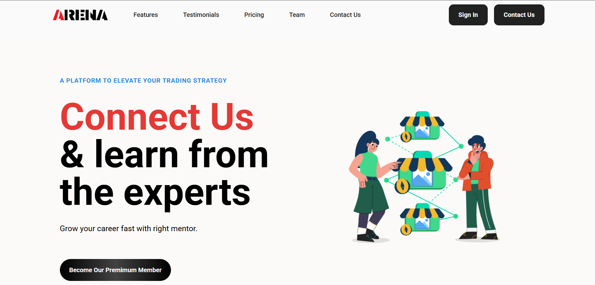
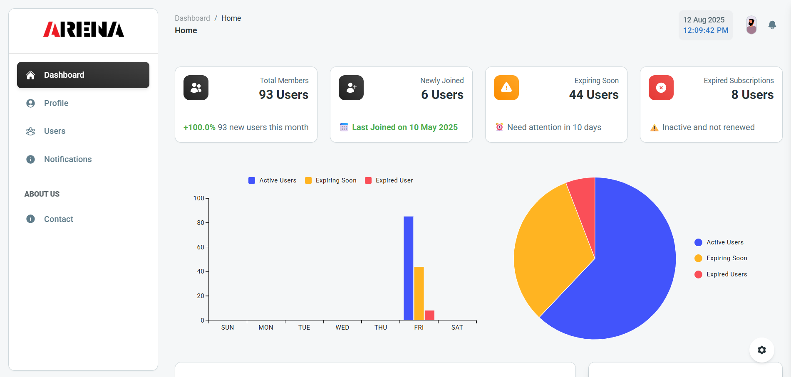
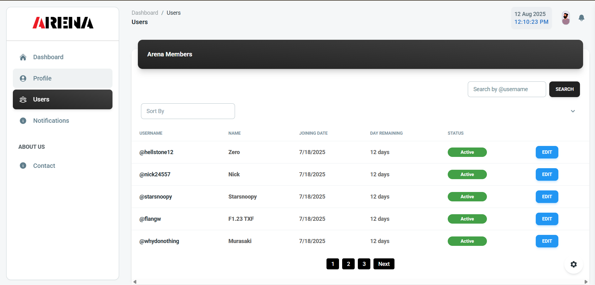

# 🏆 Arena User Management — Production-Ready Full-Stack App

  
*A modern, scalable, and production-grade user management platform integrated with Telegram for automated subscription handling.*

---

## 📖 Introduction
**Arena User Management** is a full-stack web application designed to manage and automate user subscriptions for a private Telegram group.  
Built for **real-world production deployment**, it combines the power of **Node.js, Express, MongoDB, and React** with seamless **Telegram Bot API** integration.

Whether you’re an administrator managing hundreds of members or a platform owner looking for a scalable subscription solution, **Arena** ensures:
- Fully automated subscription lifecycle handling
- A secure and user-friendly admin interface
- Reliable backend operations with scheduled jobs
- Optimized database performance for growing user bases

Its architecture is modular, maintainable, and ready to scale — making it equally suitable for small communities and large enterprises.

---
## 📌 Overview
**Arena User Management** is a **full-stack production-grade application** built to manage users in a **Telegram private group** with advanced subscription management, automated notifications, and a secure **admin dashboard**.

It enables:
- Automated user data syncing from Telegram
- Admin-powered CRUD operations
- Subscription tracking & reminders
- Seamless bot integration for real-time updates

This project is **production-ready**, designed for **scalability**, **security**, and **reliability**.

---

## 🚀 Key Features
- **🔗 Telegram Bot Integration** — Auto-fetches and updates user subscription details.
- **📅 Subscription Auto-Management** — Cron job updates days left & marks expired subscriptions automatically.
- **⚡ Real-Time Notifications** — Individual Telegram alerts before subscription expiry.
- **🖥 Admin Dashboard** — Manage all users, view plans, update subscriptions.
- **🌐 Public Landing Page** — Accessible to everyone with details about plans.
- **🔒 Role-Based Access** — Secure admin authentication.
- **🛠 Production-Level Stack** — Optimized code, modular structure, API security, and scalable DB setup.

---

## 📂 Folder Structure


#### root folder
    ├── api/                     # Backend server
    │   ├── config/              # Configuration files (DB, environment, etc.)
    │   ├── controllers/         # API request handlers
    │   ├── middleware/          # Authentication, validation, and request processing
    │   ├── models/              # Mongoose schemas and models
    │   ├── repository/          # Data access layer (DB queries, abstraction)
    │   ├── routes/              # API route definitions
    │   └── utils/               # Utility and helper functions
    │
    ├── client/                  # Frontend React application
    │   ├── public/              # Static assets
    │   └── src/                 # React components, pages, hooks, etc.
    │
    ├── .env                      # Environment variables
    ├── index.js                  # Backend entry point
    ├── package.json              # Node.js dependencies and scripts
    ├── package-lock.json         # Dependency lock file
    └── README.md                 # Project documentation
    


---

## 🛠 Tech Stack


---

## 📸 Screenshots

### 📊 Admin Dashboard


### 📅 Users Management


---

## ⚙️ Installation & Setup

```bash
# Clone the repository
git clone https://github.com/Asifsaifali/ArenaUserManagement.git
cd ArenaUserManagement
```
```bash
# Backend setup
cd api
npm install
```
```bash
cd ../client
npm install
```
```bash
# Backend
cd api
npm run dev
```
```bash
# Frontend
cd client
npm start
```
